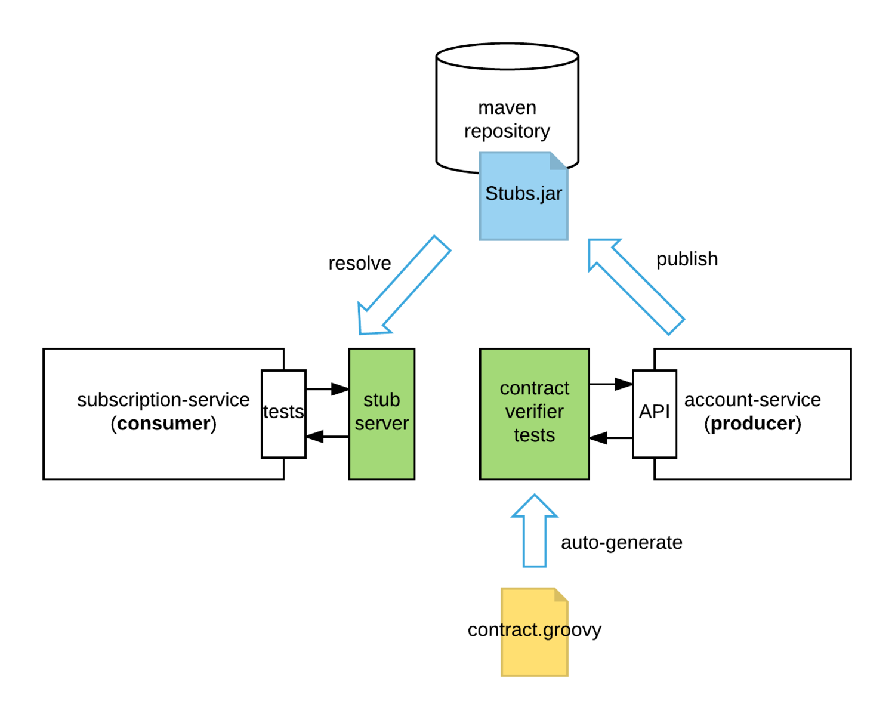

How to run:

How to generate and run generated producer tests:
- gradle :producer-contact-tests:clean
- gradle :producer-contact-tests:generateContractTests
- gradle :producer-contact-tests:test

How to run consumer test with wiremock:
add to unit stub server jar
(Usually, save stab.jar on remote server, but here locally by classpath)
```
@AutoConfigureStubRunner(
ids = {"com.github.sensesnet:producer-contact-tests:+:stubs:8080"},
stubsMode = StubRunnerProperties.StubsMode.CLASSPATH)
```

Structure:


What you need:
- Java
- Spring Boot (^1.4.1.RELEASE)
- Spring Cloud Contract (^1.0.1.RELEASE)
- Gradle (^3.1)
- Maven repository

In this demo, we have two microservices: subscription and account. We need to add a new feature to the subscription service so that a subscription for a friend’s account will be free. To find out if an account is labelled as ‘friend’, the subscription service needs to consume the account service’s “get account by ID” API. You can find the source code for this blog on GitHub.

Usage
Use Gradle to test, build and publish artifacts for local development.

subscription-service (consumer) tasks
- **test**  (Runs the unit tests)
- **build** (Test and assemble uber jar)

account-service (producer) tasks

In addition to test and build, there are other tasks specific to the producer:

- **generateContractTests** - Generate API verification tests from the contracts
- **generateWireMockClientStubs** - Generate WireMock client stubs from the contracts
- **install** - Install artifacts including stubs.jar into the local Maven repository
- **uploadArchives** - Upload artifacts to remote repository

https://sysout.ru/testirovanie-kontrollerov-s-pomoshhyu-mockmvc/


Aw, yes sorry I did edit the initial post to add more details. I also have a typo in the sample response above as "customers" is invalid JSON.

Thank you for your help, you have lead me down the following path (detailed below) where I have uncovered what I feel is my issue.
I'm going to keep digging, but it seems I need to get my extracted field to be set with a PathType.MULTI. If it is, then the tests pass.
If you have any additional suggestions I greatly welcome them, but regardless thanks for your assistance so far.

**spring-restdocs-core-2.0.0.RELEASE**

```
org.springframework.restdocs.payload.FieldPathPayloadSubsectionExtractor.java

@Override
public byte[] extractSubsection(byte[] payload, MediaType contentType) {
try {
ExtractedField extractedField = new JsonFieldProcessor().extract(
this.fieldPath, objectMapper.readValue(payload, Object.class));
Object value = extractedField.getValue();
if (value instanceof List && extractedField.getType() == PathType.MULTI) {
List<?> extractedList = (List<?>) value;
if (extractedList.size() == 1) {
value = extractedList.get(0);
}
else {
throw new PayloadHandlingException(this.fieldPath
+ " does not uniquely identify a subsection of the payload");
}
}
return objectMapper.writeValueAsBytes(value);
}
catch (IOException ex) {
throw new PayloadHandlingException(ex);
}
}
```
Where this.fieldPath is "information.customers[]" (also tested with various paths, see below)
Object value is the LinkedHashMap (which is expected)
However, extractedField.getType() equals PathType.SINGLE, which causes value instanceof List && extractedField.getType() == PathType.MULTI to evaluate to false. If this evaluates to true then the tests pass.

The only place that I am finding the PathType get set is by:

```
org.springframework.restdocs.payload.JsonFieldPath.java

static boolean matchesSingleValue(List<String> segments) {
Iterator<String> iterator = segments.iterator();
while (iterator.hasNext()) {
String segment = iterator.next();
if ((isArraySegment(segment) && iterator.hasNext())
|| isWildcardSegment(segment)) {
return false;
}
}
return true;
}
```
I am not able to get the segment to fulfill the isArraySegment or the isWildcardSegment and still be a valid path.

Test Code

```
List<FieldDescriptor> responseFieldDescriptors = new ArrayList<>();
responseFieldDescriptors.add(fieldWithPath("details").type(JsonFieldType.STRING).description("Details to display to the customer."));
responseFieldDescriptors.add(fieldWithPath("name").type(JsonFieldType.STRING).description("Customer's name."));


resultActions.andDo(
MockMvcRestDocumentation.document("content-example",
preprocessRequest(prettyPrint()),
preprocessResponse(prettyPrint()),
responseFields(beneathPath("information.customers[]").withSubsectionId("customer"), responseFieldDescriptors)
)
);
```
Test also passes with the following if I manually modify extractedField's type while debugging to PathType.MULTI:
```
beneathPath("information.customers")
beneathPath("information['customers']")
beneathPath("information.customers[]")
beneathPath("information.customers.[]")
```

**Sample Response**:

```
{
"information": {
"customers": [{
"details": "test details",
"name": "testName"
}]
}
}
```